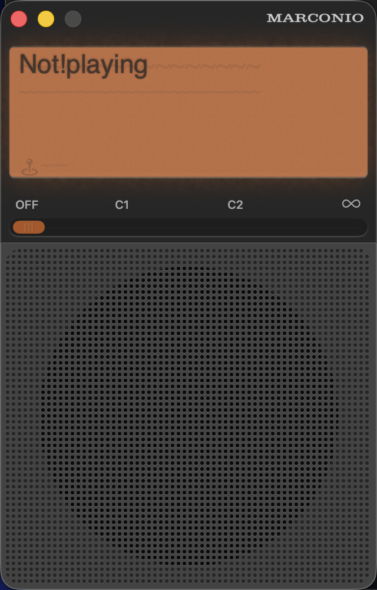

## About

Marconio is a focused macOS and iOS radio for streaming the live channels and mixtapes from [NTS](https://www.nts.live).

On macOS it integrates with Now Playing, Control Centre, media keys, AirPlay, and the menu bar. The LCD, menu bar, and system playback information update with the public programme metadata supplied by NTS without interrupting the stream.

If you like this app, please support NTS—they provide an excellent listener-supported service.

**[Support NTS](https://www.nts.live/supporters)**

## Download

If you'd like to download Marconio, head on over to the [latest release page](https://github.com/brianmichel/Marconio/releases/latest) and download the `.dmg` attached to the release.

This app uses Sparkle to keep itself up to date. After you've installed one version of Marconio from the releases page you can continue to update to later versions from within the app.

## Menu bar

Marconio can keep playing while its main window is closed and while its Dock icon is hidden. Its menu bar item shows the current programme and channel and provides commands to pause or resume, open Marconio, show or hide the Dock icon, and quit.

## NTS metadata

For a tuned live channel, Marconio periodically refreshes the current show, channel, and location from the public NTS API. NTS does not guarantee artist-and-track information in its public live feed; live tracklists are an NTS supporter feature, so Marconio displays programme-level metadata when that is all the public service provides.

## AirPlay

Use the AirPlay icon in the lower-right corner of the LCD to choose an available speaker, soundbar, or TV. The receiver must support AirPlay and be reachable from the Mac. Playback routing is selected independently in each app.

## Screenshots

